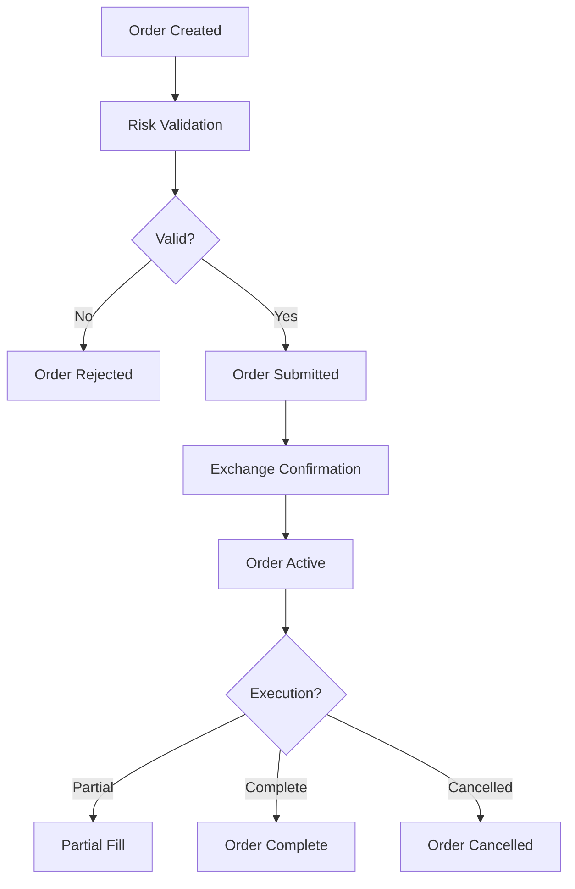
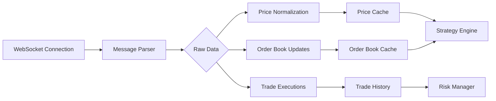

# 🏗️ Architecture Guide

This document provides an in-depth overview of the Robinhood Crypto Trading Bot's architecture, design patterns, and system components.

## System Overview

The trading bot follows a modular, event-driven architecture designed for high performance, reliability, and maintainability. The system is built around several core principles:

- **Asynchronous Processing**: All operations use async/await for non-blocking I/O
- **Event-Driven Design**: Components communicate through events and message queues
- **Modular Architecture**: Each component has a single responsibility
- **Configuration Management**: Centralized configuration with environment-specific overrides
- **Error Resilience**: Comprehensive error handling and recovery mechanisms

## Core Architecture

```
┌─────────────────────────────────────────────────────────────────┐
│                    Robinhood Crypto Trading Bot                │
├─────────────────────────────────────────────────────────────────┤
│                                                                 │
│  ┌─────────────┐  ┌──────────────┐  ┌─────────────────┐         │
│  │   Config    │  │   Logging    │  │   Monitoring     │         │
│  │  Manager    │  │  & Metrics   │  │   & Health      │         │
│  └─────────────┘  └──────────────┘  └─────────────────┘         │
│                                                                 │
├─────────────────────────────────────────────────────────────────┤
│  ┌─────────────┐  ┌──────────────┐  ┌─────────────────┐         │
│  │   API       │  │   Trading    │  │   Risk          │         │
│  │  Clients    │  │   Engine     │  │   Manager       │         │
│  └─────────────┘  └──────────────┘  └─────────────────┘         │
│                                                                 │
│  ┌─────────────┐  ┌──────────────┐  ┌─────────────────┐         │
│  │   Market    │  │   Strategy   │  │   Position      │         │
│  │   Data      │  │   Registry   │  │   Manager       │         │
│  └─────────────┘  └──────────────┘  └─────────────────┘         │
│                                                                 │
│  ┌─────────────────────────────────────────────────────────┐     │
│  │              Application Orchestrator                   │     │
│  │                                                         │     │
│  │  • Lifecycle Management    • Component Coordination    │     │
│  │  • Health Monitoring       • Error Recovery           │     │
│  │  • Configuration Loading   • Resource Management      │     │
│  └─────────────────────────────────────────────────────────┘     │
└─────────────────────────────────────────────────────────────────┘
```

## Component Architecture

### Application Orchestrator (`src/core/app/`)

The central coordination component that manages the entire application lifecycle.

**Responsibilities:**
- Component initialization and startup
- Dependency injection and wiring
- Health monitoring and status reporting
- Graceful shutdown and cleanup
- Configuration management

**Key Classes:**
- `ApplicationOrchestrator`: Main application controller
- `ComponentManager`: Manages component lifecycle
- `HealthChecker`: Monitors component health
- `ShutdownHandler`: Handles graceful shutdown

**Usage:**
```python
from src.core.app.orchestrator import ApplicationOrchestrator

# Initialize and start the application
orchestrator = ApplicationOrchestrator()
await orchestrator.initialize()
await orchestrator.start()

# Monitor application status
status = orchestrator.get_status()
print(f"Running: {status['is_running']}")
print(f"Components: {status['components']}")

# Graceful shutdown
await orchestrator.shutdown()
```

### API Layer (`src/core/api/`)

Handles all external API communications with optimized performance and reliability.

**Components:**
- **RobinhoodClient**: High-performance Robinhood API client
- **Authentication**: Signature-based auth with key management
- **Rate Limiting**: Token bucket algorithm for API limits
- **Connection Pooling**: HTTP connection reuse and management
- **Error Handling**: Structured exception hierarchy

**Features:**
- Connection pooling (100 total, 10 per host)
- DNS caching (300s TTL)
- Request/response compression
- Exponential backoff retry logic
- Comprehensive logging and metrics

**Rate Limiting Strategy:**
```python
# Multiple rate limit buckets
rate_limits = {
    'global': {'requests': 100, 'window': 60},      # 100/min total
    'trading': {'requests': 30, 'window': 60},      # 30/min trading
    'market_data': {'requests': 200, 'window': 60}, # 200/min quotes
    'account': {'requests': 20, 'window': 60}       # 20/min account
}
```

### Trading Engine (`src/core/engine/`)

Core trading logic and order management system.

**Components:**
- **TradingEngine**: Main trading logic coordinator
- **OrderManager**: Order lifecycle management
- **PositionManager**: Portfolio position tracking
- **ExecutionEngine**: Order execution and routing

**Order Lifecycle:**


**Key Methods:**
```python
# Place a new order
order = await trading_engine.place_order({
    'symbol': 'BTC/USD',
    'side': 'BUY',
    'type': 'LIMIT',
    'quantity': 0.001,
    'price': 50000,
    'strategy': 'market_making'
})

# Monitor order status
status = trading_engine.get_order_status(order.id)
print(f"Status: {status['state']}, Filled: {status['filled_quantity']}")

# Cancel order if needed
await trading_engine.cancel_order(order.id)
```

### Strategy System (`src/strategies/`)

Pluggable trading strategy framework with support for multiple algorithms.

**Architecture:**
- **BaseStrategy**: Abstract base class for all strategies
- **StrategyRegistry**: Manages strategy loading and execution
- **Signal Generation**: Event-driven signal processing
- **Risk Integration**: Built-in risk management per strategy

**Strategy Interface:**
```python
class BaseStrategy(ABC):
    """Abstract base class for trading strategies."""

    @abstractmethod
    async def generate_signals(self, market_data: Dict) -> List[Signal]:
        """Generate trading signals based on market data."""
        pass

    @abstractmethod
    def calculate_position_size(self, capital: Decimal, risk: float) -> Decimal:
        """Calculate position size based on risk parameters."""
        pass

    def validate_signal(self, signal: Signal) -> bool:
        """Validate signal before execution."""
        return True
```

**Market Making Strategy Example:**
```python
class MarketMakingStrategy(BaseStrategy):
    """Market making strategy implementation."""

    async def generate_signals(self, market_data: Dict) -> List[Signal]:
        spread = self.calculate_spread(market_data)
        if spread > self.min_spread:
            return [
                Signal(action='BUY', price=market_data['bid'] + 0.001),
                Signal(action='SELL', price=market_data['ask'] - 0.001)
            ]
        return []

    def calculate_spread(self, market_data: Dict) -> float:
        """Calculate bid-ask spread percentage."""
        return (market_data['ask'] - market_data['bid']) / market_data['mid_price']
```

### Risk Management (`src/risk/`)

Comprehensive risk management system with multiple layers of protection.

**Risk Layers:**
1. **Pre-Trade Risk**: Order validation before submission
2. **Portfolio Risk**: Overall portfolio exposure limits
3. **Position Risk**: Individual position sizing
4. **Market Risk**: Correlation and concentration limits
5. **Operational Risk**: System and connectivity monitoring

**Risk Metrics:**
```python
class RiskMetrics:
    """Comprehensive risk metrics calculation."""

    def calculate_var(self, positions: Dict, confidence: float = 0.95) -> Decimal:
        """Calculate Value at Risk."""
        # Implementation using historical simulation or parametric methods
        pass

    def calculate_correlation_risk(self, positions: Dict) -> float:
        """Calculate correlation-based concentration risk."""
        # Implementation using correlation matrix analysis
        pass

    def check_drawdown_limits(self, current_value: Decimal) -> bool:
        """Check if current drawdown exceeds limits."""
        # Implementation with drawdown monitoring
        pass
```

**Risk Limits Configuration:**
```yaml
risk:
  max_portfolio_risk: 0.1      # 10% max portfolio risk
  max_position_risk: 0.02      # 2% max risk per position
  max_correlation: 0.7         # 70% max correlation between positions
  max_drawdown: 0.2           # 20% max drawdown
  stop_loss_default: 0.05     # 5% default stop loss
  take_profit_default: 0.15   # 15% default take profit
```

### Market Data (`src/core/websocket/`)

Real-time market data processing with WebSocket connections.

**Components:**
- **MarketDataClient**: WebSocket client for price feeds
- **PriceAggregator**: Price normalization and aggregation
- **OrderBookManager**: Order book depth management
- **TradeStream**: Trade execution stream processing

**Data Flow:**


**WebSocket Management:**
```python
class WebSocketManager:
    """Manages WebSocket connections with auto-reconnection."""

    async def connect(self, url: str):
        """Establish WebSocket connection with retry logic."""
        self.connection = await websockets.connect(
            url,
            ping_interval=20,
            timeout=10,
            max_size=2**20  # 1MB max message size
        )

    async def subscribe_symbol(self, symbol: str):
        """Subscribe to price updates for a symbol."""
        await self.connection.send({
            'type': 'subscribe',
            'symbols': [symbol]
        })

    async def handle_message(self, message: dict):
        """Process incoming WebSocket messages."""
        if message['type'] == 'price_update':
            await self.price_cache.update(message['data'])
        elif message['type'] == 'orderbook_update':
            await self.orderbook_cache.update(message['data'])
```

## Data Architecture

### Storage Layer

**Redis Integration:**
- **Caching**: Market data, order status, user sessions
- **Pub/Sub**: Event distribution between components
- **Rate Limiting**: API call tracking and enforcement
- **Configuration**: Dynamic configuration updates

**Database Schema:**
```sql
-- Orders table
CREATE TABLE orders (
    id VARCHAR PRIMARY KEY,
    symbol VARCHAR NOT NULL,
    side VARCHAR NOT NULL,  -- BUY/SELL
    type VARCHAR NOT NULL,  -- MARKET/LIMIT/STOP
    quantity DECIMAL NOT NULL,
    price DECIMAL,
    status VARCHAR NOT NULL,  -- PENDING/ACTIVE/FILLED/CANCELLED
    strategy VARCHAR,
    created_at TIMESTAMP DEFAULT CURRENT_TIMESTAMP,
    updated_at TIMESTAMP DEFAULT CURRENT_TIMESTAMP ON UPDATE CURRENT_TIMESTAMP
);

-- Positions table
CREATE TABLE positions (
    id VARCHAR PRIMARY KEY,
    symbol VARCHAR NOT NULL,
    quantity DECIMAL NOT NULL,
    avg_entry_price DECIMAL NOT NULL,
    current_price DECIMAL,
    unrealized_pnl DECIMAL,
    strategy VARCHAR,
    created_at TIMESTAMP DEFAULT CURRENT_TIMESTAMP,
    updated_at TIMESTAMP DEFAULT CURRENT_TIMESTAMP ON UPDATE CURRENT_TIMESTAMP
);

-- Trades table
CREATE TABLE trades (
    id VARCHAR PRIMARY KEY,
    order_id VARCHAR,
    symbol VARCHAR NOT NULL,
    side VARCHAR NOT NULL,
    quantity DECIMAL NOT NULL,
    price DECIMAL NOT NULL,
    fees DECIMAL DEFAULT 0,
    timestamp TIMESTAMP DEFAULT CURRENT_TIMESTAMP,
    FOREIGN KEY (order_id) REFERENCES orders(id)
);
```

### Event System

**Event Types:**
- **Market Events**: Price updates, order book changes, trades
- **Order Events**: Order creation, execution, cancellation
- **Risk Events**: Risk limit breaches, margin calls
- **System Events**: Health checks, errors, shutdown

**Event Flow:**
```python
class EventBus:
    """Central event distribution system."""

    def __init__(self):
        self.subscribers = defaultdict(list)

    async def publish(self, event_type: str, data: dict):
        """Publish event to all subscribers."""
        for callback in self.subscribers[event_type]:
            await callback(data)

    def subscribe(self, event_type: str, callback: Callable):
        """Subscribe to specific event type."""
        self.subscribers[event_type].append(callback)
```

## Configuration Architecture

### Configuration Hierarchy

The system uses a layered configuration approach:

1. **Default Configuration** (`config/default.yaml`)
2. **Environment Variables** (highest priority)
3. **Configuration Files** (YAML/JSON)
4. **Runtime Overrides** (lowest priority)

**Configuration Loading:**
```python
class ConfigurationManager:
    """Manages configuration from multiple sources."""

    def __init__(self):
        self.config_paths = []
        self.env_files = []

    def add_config_path(self, path: str):
        """Add configuration file path."""
        self.config_paths.append(path)

    def add_env_file(self, path: str):
        """Add environment file path."""
        self.env_files.append(path)

    def load_configuration(self) -> Settings:
        """Load and merge all configuration sources."""
        # Load defaults
        config = self.load_yaml('config/default.yaml')

        # Override with environment files
        for env_file in self.env_files:
            env_config = self.load_env_file(env_file)
            config = self.merge_configs(config, env_config)

        # Override with environment variables
        config = self.apply_env_vars(config)

        return Settings(**config)
```

### Environment-Specific Configuration

**Development:**
```yaml
app:
  debug: true
  log_level: "DEBUG"
api:
  timeout: 30
  retries: 3
```

**Production:**
```yaml
app:
  debug: false
  log_level: "INFO"
api:
  timeout: 10
  retries: 5
  rate_limit_per_minute: 1000
```

## Deployment Architecture

### Container Architecture

**Docker Compose Services:**
```yaml
services:
  trading-bot:
    build: .
    environment:
      - REDIS_URL=redis://redis:6379/0
    depends_on:
      - redis
      - prometheus

  redis:
    image: redis:alpine
    volumes:
      - redis_data:/data

  prometheus:
    image: prom/prometheus
    ports:
      - "9090:9090"
    volumes:
      - ./config/prometheus.yml:/etc/prometheus/prometheus.yml

  grafana:
    image: grafana/grafana
    ports:
      - "3000:3000"
    environment:
      - GF_SECURITY_ADMIN_PASSWORD=admin
```

### Microservices Architecture

**Service Boundaries:**
- **Trading Bot**: Core trading logic and API clients
- **Risk Service**: Risk calculation and monitoring
- **Strategy Service**: Strategy execution and management
- **Market Data Service**: Price feed aggregation and caching
- **Notification Service**: Alerts and reporting

**Inter-Service Communication:**
```python
# Using Redis pub/sub for loose coupling
import redis.asyncio as redis

class MessageBroker:
    """Inter-service message broker."""

    def __init__(self, redis_url: str):
        self.redis = redis.from_url(redis_url)

    async def publish(self, channel: str, message: dict):
        """Publish message to channel."""
        await self.redis.publish(channel, json.dumps(message))

    async def subscribe(self, channel: str):
        """Subscribe to channel messages."""
        pubsub = self.redis.pubsub()
        await pubsub.subscribe(channel)
        return pubsub
```

## Performance Architecture

### Async Architecture

**Event Loop Management:**
```python
import asyncio
from concurrent.futures import ThreadPoolExecutor

class AsyncManager:
    """Manages async operations and thread pools."""

    def __init__(self):
        self.loop = None
        self.executor = ThreadPoolExecutor(max_workers=4)

    async def initialize(self):
        """Initialize async environment."""
        self.loop = asyncio.get_running_loop()

        # Set up signal handlers
        for sig in (signal.SIGTERM, signal.SIGINT):
            self.loop.add_signal_handler(sig, self.shutdown)

    async def run_in_executor(self, func, *args):
        """Run blocking function in thread pool."""
        return await self.loop.run_in_executor(self.executor, func, *args)

    def shutdown(self):
        """Handle shutdown signals."""
        # Cleanup and exit
        pass
```

### Connection Pooling

**HTTP Connection Management:**
```python
class ConnectionPoolManager:
    """Manages HTTP connection pools."""

    def __init__(self):
        self.connector = aiohttp.TCPConnector(
            limit=100,                    # Total connection pool size
            limit_per_host=10,           # Max connections per host
            ttl_dns_cache=300,           # DNS cache TTL
            use_dns_cache=True,
            keepalive_timeout=30,
            enable_cleanup_closed=True
        )

    def create_session(self) -> aiohttp.ClientSession:
        """Create HTTP session with connection pooling."""
        timeout = aiohttp.ClientTimeout(total=30)
        return aiohttp.ClientSession(
            connector=self.connector,
            timeout=timeout,
            trust_env=True
        )
```

## Security Architecture

### Authentication & Authorization

**API Key Management:**
```python
class APIKeyManager:
    """Manages API key lifecycle and validation."""

    def validate_key(self, key: str) -> bool:
        """Validate API key format and permissions."""
        # Implement key validation logic
        pass

    def rotate_key(self, old_key: str, new_key: str):
        """Rotate API keys securely."""
        # Implement key rotation with zero downtime
        pass
```

**Request Signing:**
```python
class RequestSigner:
    """Signs API requests for security."""

    def sign_request(self, method: str, url: str, body: dict) -> dict:
        """Sign request with HMAC-SHA256."""
        timestamp = int(time.time())
        message = f"{method}{url}{timestamp}{json.dumps(body)}"

        signature = hmac.new(
            self.secret_key.encode(),
            message.encode(),
            hashlib.sha256
        ).hexdigest()

        return {
            'X-Timestamp': timestamp,
            'X-Signature': signature
        }
```

### Data Protection

**Encryption at Rest:**
```python
class DataEncryptor:
    """Encrypts sensitive data at rest."""

    def encrypt(self, data: str) -> str:
        """Encrypt data using AES-256."""
        # Implementation using cryptography library
        pass

    def decrypt(self, encrypted_data: str) -> str:
        """Decrypt data using AES-256."""
        # Implementation using cryptography library
        pass
```

## Monitoring Architecture

### Metrics Collection

**Prometheus Metrics:**
```python
from prometheus_client import Counter, Gauge, Histogram

# Trading metrics
orders_total = Counter('orders_total', 'Total orders placed', ['symbol', 'side', 'strategy'])
order_fill_time = Histogram('order_fill_seconds', 'Order fill time', ['symbol'])

# Performance metrics
api_requests_total = Counter('api_requests_total', 'API requests', ['endpoint', 'method'])
api_request_duration = Histogram('api_request_duration_seconds', 'API request duration')

# Risk metrics
portfolio_risk = Gauge('portfolio_risk_ratio', 'Current portfolio risk ratio')
position_count = Gauge('positions_active', 'Number of active positions')
```

### Health Monitoring

**Health Check Endpoints:**
```python
class HealthChecker:
    """Comprehensive health monitoring."""

    async def check_api_connectivity(self) -> bool:
        """Check API connectivity."""
        try:
            async with self.http_client.get('/health') as response:
                return response.status == 200
        except Exception:
            return False

    async def check_database_connectivity(self) -> bool:
        """Check database connectivity."""
        try:
            await self.redis.ping()
            return True
        except Exception:
            return False

    async def check_strategy_health(self) -> Dict[str, bool]:
        """Check strategy component health."""
        health = {}
        for name, strategy in self.strategies.items():
            health[name] = await strategy.health_check()
        return health
```

## Error Handling Architecture

### Exception Hierarchy

```python
class CryptoTradingError(Exception):
    """Base exception for crypto trading errors."""
    def __init__(self, message: str, code: str = None, details: dict = None):
        super().__init__(message)
        self.code = code
        self.details = details or {}

class CryptoAPIError(CryptoTradingError):
    """API-related errors."""
    pass

class CryptoMarketDataError(CryptoAPIError):
    """Market data specific errors."""
    def __init__(self, message: str, symbols: List[str] = None):
        super().__init__(message, 'MARKET_DATA_ERROR', {'symbols': symbols})

class CryptoTradingError(CryptoAPIError):
    """Trading operation errors."""
    def __init__(self, message: str, symbol: str, order_type: str = None):
        super().__init__(message, 'TRADING_ERROR', {
            'symbol': symbol,
            'order_type': order_type
        })

class CryptoRiskError(CryptoTradingError):
    """Risk management related errors."""
    def __init__(self, message: str, risk_type: str, current_value: float, limit: float):
        super().__init__(message, 'RISK_BREACH', {
            'risk_type': risk_type,
            'current_value': current_value,
            'limit': limit
        })
```

### Circuit Breaker Pattern

```python
class CircuitBreaker:
    """Circuit breaker for external service calls."""

    def __init__(self, failure_threshold: int = 5, recovery_timeout: int = 60):
        self.failure_threshold = failure_threshold
        self.recovery_timeout = recovery_timeout
        self.failure_count = 0
        self.last_failure_time = None
        self.state = 'CLOSED'  # CLOSED, OPEN, HALF_OPEN

    async def call(self, func: Callable, *args, **kwargs):
        """Execute function with circuit breaker protection."""
        if self.state == 'OPEN':
            if self._should_attempt_reset():
                self.state = 'HALF_OPEN'
            else:
                raise CircuitBreakerOpen()

        try:
            result = await func(*args, **kwargs)
            self._on_success()
            return result
        except Exception as e:
            self._on_failure()
            raise e

    def _on_success(self):
        """Handle successful call."""
        self.failure_count = 0
        self.state = 'CLOSED'

    def _on_failure(self):
        """Handle failed call."""
        self.failure_count += 1
        self.last_failure_time = time.time()

        if self.failure_count >= self.failure_threshold:
            self.state = 'OPEN'
```

## Deployment Patterns

### Blue-Green Deployment

**Deployment Strategy:**
```yaml
# Blue environment (current production)
blue:
  replicas: 3
  version: "1.2.0"
  traffic: 100%

# Green environment (new version)
green:
  replicas: 3
  version: "1.3.0"
  traffic: 0%
```

**Deployment Process:**
1. Deploy green environment with new version
2. Run health checks and integration tests
3. Gradually shift traffic from blue to green
4. Monitor error rates and performance
5. Complete cutover or rollback if issues detected

### Canary Deployment

**Canary Strategy:**
```python
class CanaryDeployment:
    """Manages canary deployments with traffic splitting."""

    async def deploy_canary(self, version: str, traffic_percentage: int = 10):
        """Deploy canary with specified traffic percentage."""
        # Deploy canary version
        await self.kubernetes.deploy('canary', version)

        # Configure traffic splitting
        await self.istio.configure_traffic_split({
            'primary': {'weight': 100 - traffic_percentage},
            'canary': {'weight': traffic_percentage}
        })

        # Monitor canary metrics
        await self.monitor_canary_health()
```

## Best Practices

### Code Organization

**Separation of Concerns:**
- **API Layer**: External communications only
- **Business Logic**: Trading logic and rules
- **Data Layer**: Data access and persistence
- **Infrastructure**: Configuration, logging, monitoring

**Dependency Injection:**
```python
class TradingEngine:
    """Trading engine with dependency injection."""

    def __init__(
        self,
        api_client: APIClient,
        risk_manager: RiskManager,
        order_manager: OrderManager,
        config: TradingConfig
    ):
        self.api_client = api_client
        self.risk_manager = risk_manager
        self.order_manager = order_manager
        self.config = config
```

### Performance Optimization

**Connection Reuse:**
```python
# Use context managers for proper cleanup
async with aiohttp.ClientSession() as session:
    async with session.get(url) as response:
        data = await response.json()

# Connection pooling is handled automatically
```

**Batch Operations:**
```python
# Good - batch API calls
symbols = ['BTC', 'ETH', 'ADA', 'SOL']
quotes = await api_client.get_quotes(symbols)

# Avoid - individual calls in loop
for symbol in symbols:
    quote = await api_client.get_quote(symbol)  # Inefficient!
```

**Caching Strategy:**
```python
class CacheManager:
    """Multi-level caching strategy."""

    def __init__(self):
        self.memory_cache = {}  # Fast in-memory cache
        self.redis_cache = None  # Persistent Redis cache

    async def get(self, key: str):
        """Get value with cache hierarchy."""
        # Check memory cache first
        if key in self.memory_cache:
            return self.memory_cache[key]

        # Check Redis cache
        if self.redis_cache:
            value = await self.redis_cache.get(key)
            if value:
                self.memory_cache[key] = value  # Cache in memory
                return value

        return None
```

This architecture provides a solid foundation for building reliable, scalable, and maintainable cryptocurrency trading systems while maintaining clean separation of concerns and comprehensive error handling.